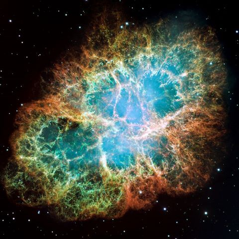

># **Supernova** 

## Introduction

 A supernova is a massive explosion that occurs when a star dies, and is one of the most violent events in the universe.
 A supernova occurs when a star runs out of fuel and collapses,creating a shock wave that blows off the star's outer layers.
This explosion is so bright that it can outshine entire galaxies, and can be seen from billions of light-years away 

Crab Nebula's supernova remnant.
## Impact on the Universe:

1. Supernovae create and distribute heavy elements (e.g., iron, gold) essential for life.
2. Their shockwaves trigger star formation in nearby regions.
3. Influence the evolution and structure of galaxies.

## Observations:

1. Detected using telescopes (optical, X-ray, and radio) and satellites.
2. Type Ia supernovae are used as "standard candles" to measure cosmic distances.
3. Famous events include SN 1987A and the Crab Nebula's supernova remnant.

## Conclusion:

1. Supernovae are pivotal in shaping the universe, enriching it with heavy elements and driving cosmic evolution.
2. Their study deepens our understanding of stellar life cycles and the expansion of the universe.

## Future Scope:

1. Advances in technology could improve supernova detection and prediction.
2. Research may uncover more about dark energy, black holes, and neutron stars linked to supernovae.
